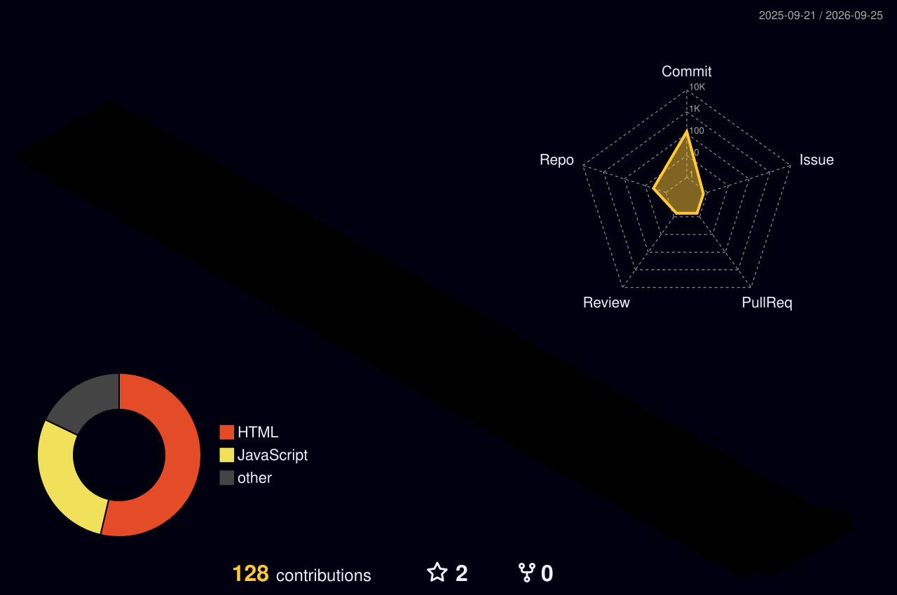

### Stats

### Stack

### Stack

  <picture>
    <source media="(prefers-color-scheme: dark)" srcset="sky-night.svg" />
    
  </picture>

<!-- your actual content -->

  <picture>
    <source media="(prefers-color-scheme: dark)" srcset="garden-footer-night.svg" />
    
  </picture>

